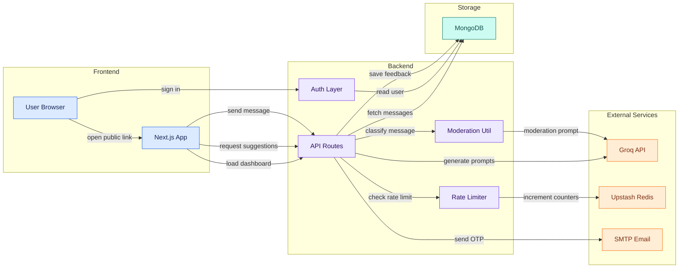

# MessageMint

MessageMint is a full-stack anonymous feedback platform for collecting honest, low-friction messages through a public shareable profile link. Link owners can create an account, verify their email, share a username-based URL, and manage incoming anonymous messages from a private dashboard. Visitors do not need to log in: they can open a public link, write a message, optionally use AI-generated contextual prompts, and submit feedback directly.

The project goes beyond a basic message box by adding production-minded safety and reliability layers: IP-based rate limiting with Upstash Redis, Groq-powered content moderation before database writes, contextual AI suggestions based on the receiver's stated purpose, filtered-message controls for receivers, and secure account flows with NextAuth and email verification.

---

## Features

- **Anonymous public links**: each user gets a shareable `/u/[username]` page where anyone can send feedback without signing in.
- **Authenticated dashboard**: receivers can view, refresh, and delete incoming anonymous messages from a private dashboard.
- **Message acceptance controls**: users can pause or resume their public inbox with an accepting-messages toggle.
- **Upstash Redis rate limiting**: protects public message submission with per-link and global IP-based limits.
- **AI content moderation**: classifies every incoming message with Groq before saving, marking content as safe, filtered, or unmoderated.
- **Filtered-message visibility**: receivers can choose whether filtered messages appear, while threat-flagged content requires an explicit reveal click.
- **Contextual AI suggestions**: visitors can generate three conversation starters tailored to the receiver's saved purpose.
- **Custom link purpose**: receivers can describe what their board is for, such as portfolio feedback, career questions, or AMA prompts.
- **Username normalization**: public links resolve consistently even when visitors type different username casing.
- **Email verification and password reset**: account lifecycle flows are handled with OTP and reset emails via Nodemailer.
- **Responsive UI**: built with Tailwind CSS, Radix/shadcn-style components, Lucide icons, and Sonner notifications.

---

## Tech Stack

| Layer | Technology |
| --- | --- |
| Frontend | Next.js 16 App Router, React 19, TypeScript |
| Backend | Next.js API routes, NextAuth.js credentials auth |
| Database | MongoDB with Mongoose embedded message documents |
| Rate Limiting | Upstash Redis REST API via `@upstash/redis` |
| AI Suggestions | Vercel AI SDK with Groq `llama-3.3-70b-versatile` |
| AI Moderation | Vercel AI SDK with Groq `llama-3.1-8b-instant` |
| Email | Nodemailer with SMTP |
| Forms & Validation | React Hook Form, Zod |
| UI | Tailwind CSS 4, Radix UI, Lucide React, Sonner |
| HTTP Client | Axios and native `fetch` |

---

## Architecture Overview

---

## Future Improvements

- **Shareable card generator**: let receivers turn selected anonymous messages into polished social media cards for Instagram, X, LinkedIn, or WhatsApp.
- **Message analytics**: add dashboard insights for message volume, filtered-message trends, and response rates.
- **Receiver replies**: allow link owners to publish optional public replies while keeping sender identity anonymous.
- **Custom themes**: let users customize the public feedback page with colors, display names, and profile context.
- **Stronger abuse controls**: add manual blocklists, per-country throttling, and admin review queues for repeated abuse.
- **Export tools**: support CSV or JSON export for users who want to archive feedback or analyze it externally.

---

## License

This project is licensed under the [MIT License](LICENSE).
